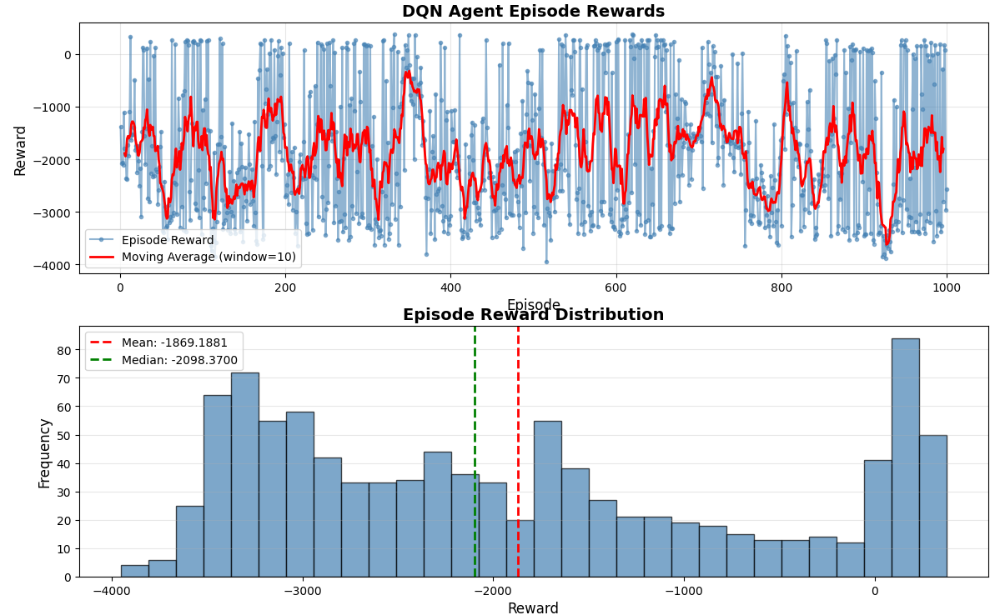
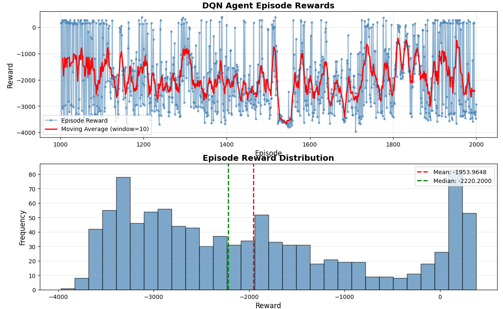
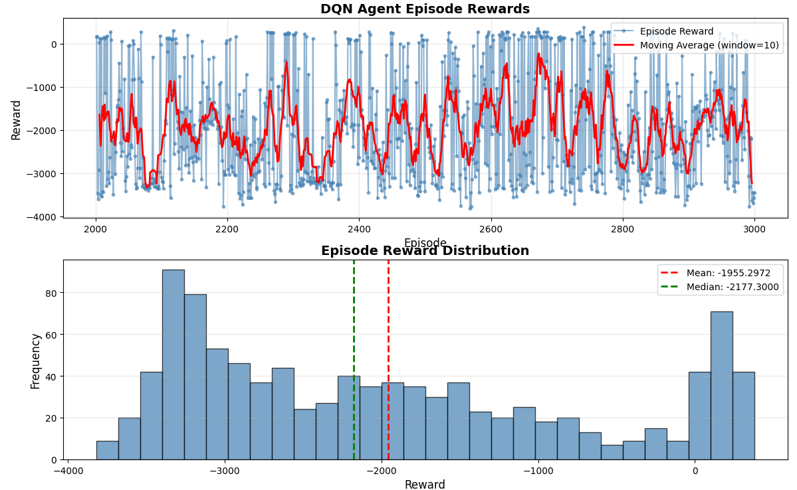
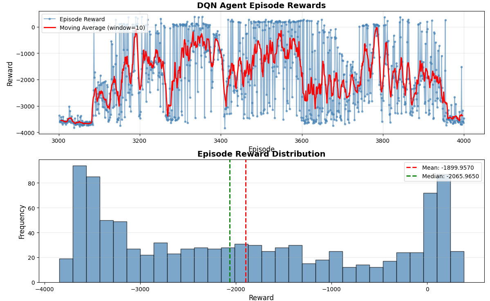
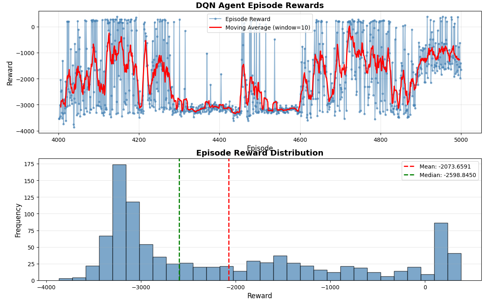
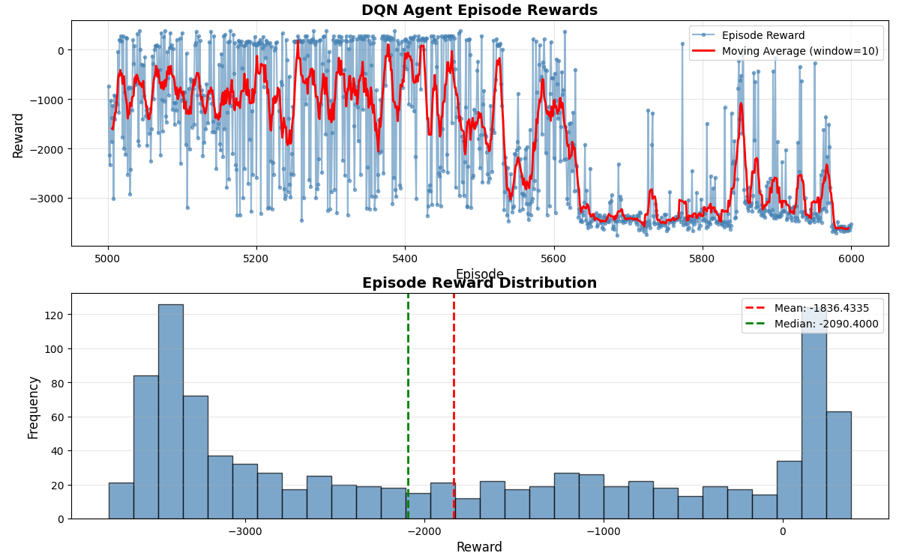
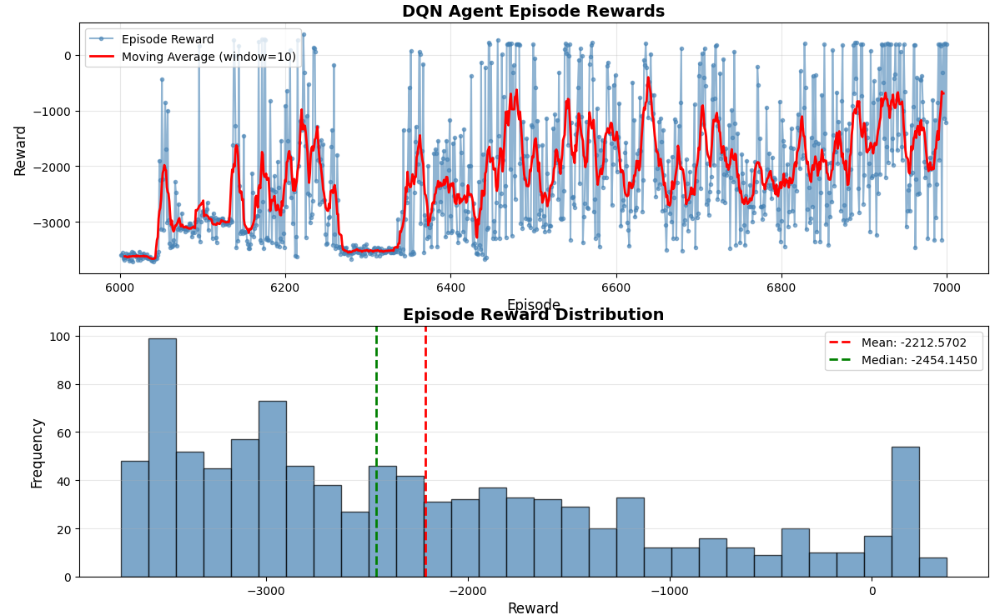

cd build
python3 ../scripts/plot_episode_rewards.py -f episode_rewards.csv -o rewards_plot.png -w 10

epsilon:0.3->0.2->0.1
learning rate:0.05
gamma_:0.95

### first 1k episodes,0~1000,2% success, 21/1000,epsilon:0.3

 
Episode 奖励统计摘要
 
总 Episode 数: 1000
最小奖励: -3953.8300
最大奖励: 379.0160
平均奖励: -1869.1881
中位数奖励: -2098.3700
标准差: 1274.3348

百分位数:
  10%: -3375.0640
  25%: -3023.8825
  50%: -2098.3700
  75%: -864.7005
  90%: 158.8655

正奖励 Episode 比例: 16.50%
 

成功读取 1000 个 Episode 的数据
奖励统计:
  最小值: -3953.8300
  最大值: 379.0160
  平均值: -1869.1881
  标准差: 1274.3348

  <tr>
    <td></a></td>
    <!-- <td></a></td> -->
  </tr>

### second 1k episodes,1000~2000, 1% success, 19/1000,epsilon:0.3

 
Episode 奖励统计摘要
 
总 Episode 数: 1000
最小奖励: -3974.5400
最大奖励: 381.0180
平均奖励: -1953.9648
中位数奖励: -2220.2000
标准差: 1270.9440

百分位数:
  10%: -3406.6650
  25%: -3042.0500
  50%: -2220.2000
  75%: -1034.0250
  90%: 160.5925

正奖励 Episode 比例: 15.50%
 

成功读取 1000 个 Episode 的数据
奖励统计:
  最小值: -3974.5400
  最大值: 381.0180
  平均值: -1953.9648
  标准差: 1270.9440

  <tr>
    <td></a></td>
    <!-- <td></a></td> -->
  </tr>

### third 1k episodes,2000~3000, 1% success, 14/1000, epsilon:0.3

 
Episode 奖励统计摘要
 
总 Episode 数: 1000
最小奖励: -3821.3400
最大奖励: 381.4120
平均奖励: -1955.2972
中位数奖励: -2177.3000
标准差: 1249.2539

百分位数:
  10%: -3351.8820
  25%: -3101.5025
  50%: -2177.3000
  75%: -1049.0100
  90%: 124.0489

正奖励 Episode 比例: 14.60%
 

成功读取 1000 个 Episode 的数据
奖励统计:
  最小值: -3821.3400
  最大值: 381.4120
  平均值: -1955.2972
  标准差: 1249.2539

  <tr>
    <td></a></td>
    <!-- <td></a></td> -->
  </tr>

### 4th 1k episodes,3000~4000, 2% success, 20/1000, epsilon:0.2

 
Episode 奖励统计摘要
 
总 Episode 数: 1000
最小奖励: -3846.9700
最大奖励: 382.9820
平均奖励: -1899.9570
中位数奖励: -2065.9650
标准差: 1392.8854

百分位数:
  10%: -3584.4200
  25%: -3272.4275
  50%: -2065.9650
  75%: -508.1575
  90%: 113.6984

正奖励 Episode 比例: 18.10%
 

成功读取 1000 个 Episode 的数据
奖励统计:
  最小值: -3846.9700
  最大值: 382.9820
  平均值: -1899.9570
  标准差: 1392.8854
  

  <tr>
    <td></a></td>
    <!-- <td></a></td> -->
  </tr>

### 5th 1k episodes,4000~5000, 1% success, 12/1000, epsilon:0.2

 
Episode 奖励统计摘要
 
总 Episode 数: 1000
最小奖励: -3869.7500
最大奖励: 381.0620
平均奖励: -2073.6591
中位数奖励: -2598.8450
标准差: 1277.2912

百分位数:
  10%: -3300.3950
  25%: -3175.8825
  50%: -2598.8450
  75%: -1130.0825
  90%: 176.5671

正奖励 Episode 比例: 13.40%
 

成功读取 1000 个 Episode 的数据
奖励统计:
  最小值: -3869.7500
  最大值: 381.0620
  平均值: -2073.6591
  标准差: 1277.2912
  

  <tr>
    <td></a></td>
    <!-- <td></a></td> -->
  </tr>

### 6th 1k episodes,5000~6000, 2% success, 26/1000, epsilon:0.1

 
Episode 奖励统计摘要
 
总 Episode 数: 1000
最小奖励: -3764.2600
最大奖励: 383.3460
平均奖励: -1836.4335
中位数奖励: -2090.4000
标准差: 1457.0627

百分位数:
  10%: -3490.5610
  25%: -3310.7750
  50%: -2090.4000
  75%: -301.3695
  90%: 202.6390

正奖励 Episode 比例: 21.90%
 

成功读取 1000 个 Episode 的数据
奖励统计:
  最小值: -3764.2600
  最大值: 383.3460
  平均值: -1836.4335
  标准差: 1457.0627
  

  <tr>
    <td></a></td>
    <!-- <td></a></td> -->
  </tr>

### 7th 1k episodes,6000~7000, 0.3% success, 3/1000, epsilon:0.1

 
Episode 奖励统计摘要
 
总 Episode 数: 1000
最小奖励: -3721.3900
最大奖励: 371.6850
平均奖励: -2212.5702
中位数奖励: -2454.1450
标准差: 1148.2260

百分位数:
  10%: -3519.8250
  25%: -3156.0925
  50%: -2454.1450
  75%: -1485.4225
  90%: -312.5030

正奖励 Episode 比例: 7.50%
 

成功读取 1000 个 Episode 的数据
奖励统计:
  最小值: -3721.3900
  最大值: 371.6850
  平均值: -2212.5702
  标准差: 1148.2260
  

  <tr>
    <td></a></td>
    <!-- <td></a></td> -->
  </tr>

